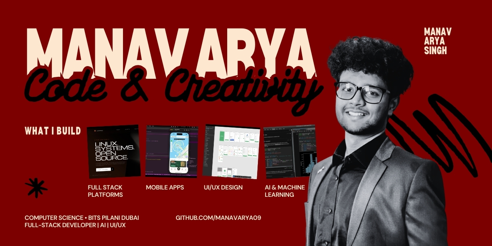

  
  

 

<table>
<tr>
<td width="70%">

</td>

<td width="30%" align="center">

  

  

</td>
</tr>
</table>
 
# Building SAVREATS    
website - https://www.savreats.ae    
SAVREATS is redefining dining in the UAE. Discover exclusive restaurant deals, split bills instantly with NFC tap-to-pay, and redeem offers in one tap. This isn't just a deals app. This is how Dubai eats.

# BITSDUBAIEVENTS  

**Jashn Website** - https://jashn.bitsdubaievents.com  
Annual cultural festival website featuring event registrations, live updates, and interactive schedules for BITS Pilani Dubai Campus's flagship cultural fest. 
*Tech Stack: Next.js, TypeScript, React, Tailwind CSS, PocketBase, Vercel*

**Bsf Website** - https://bsf.bitsdubaievents.com  
BITS Sports Fest platform with sports event management, team registrations, live scoreboards, and tournament brackets for inter-college sports competitions. 
*Tech Stack: Next.js, TypeScript, React, Tailwind CSS, PocketBase*

**Bsf-admin Website** - https://bsf-admin.bitsdubaievents.com  
Administrative dashboard for BSF organizers to manage events, registrations, teams, schedules, and real-time updates during the sports festival. 
*Tech Stack: Next.js, TypeScript, React, Tailwind CSS, PocketBase*

**Bits-transport Website** - https://bits-transport.bitsdubaievents.com  
Campus transportation management system for event logistics, shuttle tracking, route planning, and participant transportation during major campus events. 
*Tech Stack: Next.js, TypeScript, React, Google Maps API, Tailwind CSS*

**Bits-K101 lms-system** - https://physical-education.bitsdubaievents.com  
Learning Management System for physical education courses with attendance tracking and student progress monitoring. 
*Tech Stack: Next.js, TypeScript, React, PocketBase, Tailwind CSS, Chart.js*

**Bitsevents certificate generator** - https://bitscertificategenerator.bitsdubaievents.com  
Automated certificate generation tool for event participants with customizable templates, bulk generation, and digital signature integration. 
*Tech Stack: Next.js, TypeScript, React, Canvas API, PDF-lib, PocketBase*

# Creative Lab BPDC  

**Creative lab official Website** - https://creativelabbpdc.vercel.app  
Official website for Creative lab BITS Pilani Dubai Campus  showcasing technical events, workshops, research initiatives, and member resources. 
*Tech Stack: React, TypeScript, Vite, Tailwind CSS, Framer Motion, Vercel*

**Cyberthron2026 website** - https://cyberthorn2026.vercel.app  
National-level Cyber-Physical Systems Design Competition website  
*Tech Stack: React, TypeScript, Vite, Tailwind CSS, Framer Motion, Vercel*

# IEEE BPDC  

**IEEE official Website** - https://ieeebitspilanidubai.vercel.app  
Official website for IEEE BITS Pilani Dubai Campus chapter showcasing technical events, workshops, research initiatives, and member resources. 
*Tech Stack: React, TypeScript, Vite, Tailwind CSS, Framer Motion, Vercel*

**Peripherals Lab website IEEE** - https://peripherals-lab.vercel.app  
Peripherals Lab is an IoT-HCI (Internet of Things & Human-Computer Interaction (HCI)) challenge where participants design a real-time game controlled via virtual IoT hardware simulation (Wokwi/ESP32) using professional communication protocol (MQTT/WebSockets)  
*Tech Stack: Next.js, TypeScript, React, Tailwind CSS, Vercel*

**ResearchX website IEEE** - https://researchxieeebpdc.vercel.app  
Research symposium platform for IEEE featuring paper submissions, abstracts, conference schedules, and academic collaboration tools for students and faculty. 
*Tech Stack: Next.js, TypeScript, React, Tailwind CSS, Vercel*

**Datathon IEEExLUG** -  https://datathon-ieeexlug.vercel.app  
Data science hackathon website with team registrations, problem statements, leaderboards, and submission portals for collaborative IEEE x LUG event. 
*Tech Stack: Next.js, TypeScript, React, Tailwind CSS, , Vercel*

**Mouse Runner Challenge IEEExASME** - https://mouse-runner-challenge.vercel.app  
Interactive robotics competition platform for micromouse challenge featuring real-time maze solving visualizations, team standings, and event details. 
*Tech Stack: Next.js, TypeScript, React, Tailwind CSS, Vercel*

# E-cell BPDC  

**E-summit Website** - https://www.esummitbpdc.com  
Annual entrepreneurship summit platform with speaker registrations, startup competitions, pitch decks, workshop schedules, and investor networking. 
*Tech Stack: Next.js, TypeScript, React, Tailwind CSS, PocketBase, Framer Motion, Vercel*

**E-summit admin Website** - https://admin.esummitbpdc.com  
Administrative dashboard for Esummit organizers to manage events, registrations, teams, schedules, and real-time updates during the event.  
*Tech Stack: Next.js, TypeScript, React, Tailwind CSS, PocketBase*

**E-cell BPDC website** – https://ecellbpdc.vercel.app  
Entrepreneurship Cell's official portal featuring startup resources, incubation programs, speaker series, and entrepreneurship events for aspiring founders. 
*Tech Stack: Next.js 15, TypeScript, React, Tailwind CSS v4, Radix UI, shadcn/ui, Framer Motion, Zustand, TanStack Query, Vercel*

# Linux User Group BPDC   

**Linux User Group website** - https://www.lugbpdc.org  
This Linux Users Group's official website featuring team members, technical workshops, event calendars, community resources, and open-source projects. 
*Tech Stack: Next.js 15, React, TypeScript, Tailwind CSS, shadcn/ui, Radix UI, Three.js, React Three Fiber, React Hook Form, Zod*

# Student Council BPDC   

**Student-Council website** - https://studentcouncilbpdc.com  
Student Council's official website featuring council members, campus initiatives, event calendars, feedback systems, and student governance resources. 
*Tech Stack: React 18, TypeScript, Vite, Tailwind CSS, shadcn/ui, Radix UI, Three.js, React Router, React Hook Form, Zod*

# Royal Chambers Of Engineers  

**Royal Chambers Of Engineers Website** - https://www.royalchambersofengineers.in  
Corporate website for Royal Chambers Of Engineers company showcasing services, facilities, Consultation appointments . 
*Tech Stack:  Next.js, TypeScript, React, Tailwind CSS, Framer Motion, Vercel*

# Tendercare FZE  

**Tendercare Website** -  https://tendercare.com  
Corporate website for Tendercare FZE healthcare company showcasing medical services, facilities, online appointments, patient portal, and healthcare solutions. 
*Tech Stack: HTML, CSS, JavaScript, Bootstrap, PHP, MySQL*

# Udgaar 2025  

**Udgaar 2025 website** - https://www.udgaar.in  
Cultural festival website for Udgaar 2025 featuring event listings, artist lineups, ticket bookings, live updates, and interactive campus maps. 
*Tech Stack: Next.js, TypeScript, React, Tailwind CSS, Framer Motion, Vercel*

## Co-Curricular roles  
IT Head - Creative Lab BPDC  
Technical & Digital Creative Co-lead - Jashn'26  
Technical Co-lead - BSF'25   
Technical Lead - Esummit'26 BPDC  
Web Developer - IEEE BPDC  
Web Developer - Student Council   
Technical Mentor - E-CELL BPDC   
 
 ## Co-Curricular roles - outside of tech  
 Marketing Head - E-CELL BPDC   
 Creative Head - Spectrum 2026  
 GRAPHIC DESIGNER & SOCIAL MEDIA CORDINATOR - STUDENT COUNCIL BPDC    
 Media Executive  - MAD CLUB  
 Marketing Executive - ACM BPDC & LUG BPDC  
 Treasurer - Expressions, BPDC
 

 

## 🌐 Socials:
     

# 💻 Tech Stack:

## 🧠 Languages

---

## 🎨 Frontend & Creative Dev

---

## ⚙️ Backend

---

## ☁️ Cloud & Deployment

<!-- Proudly created with GPRM ( https://gprm.itsvg.in ) -->
